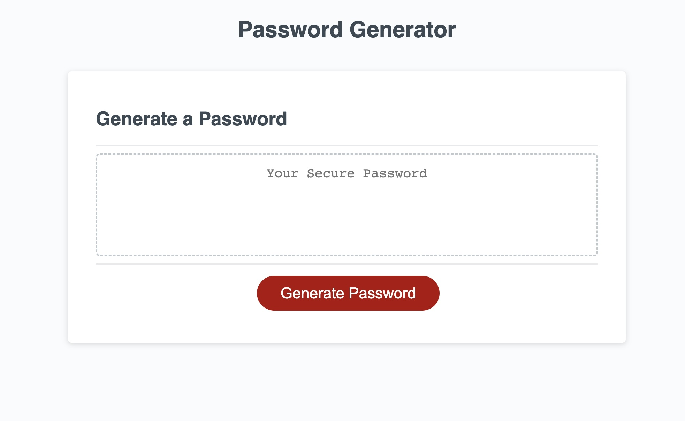
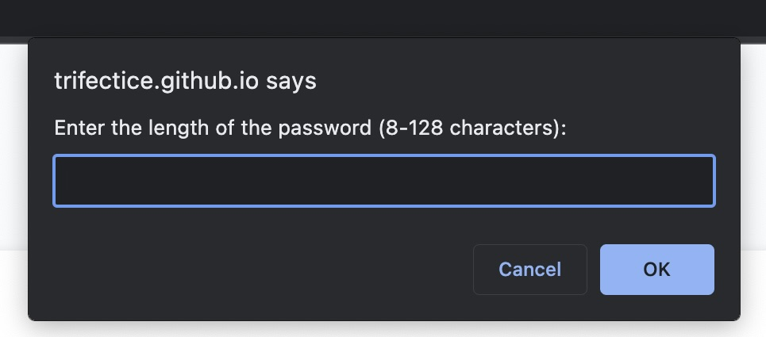
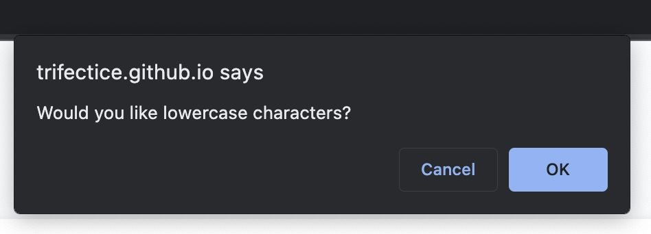
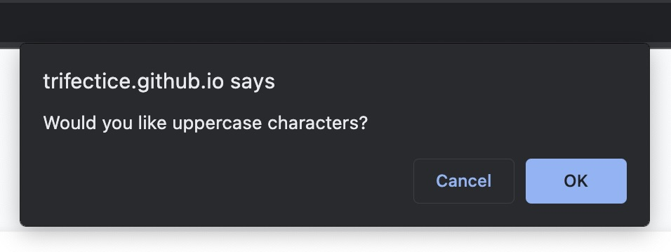
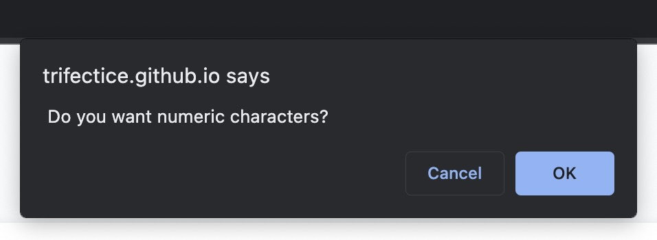
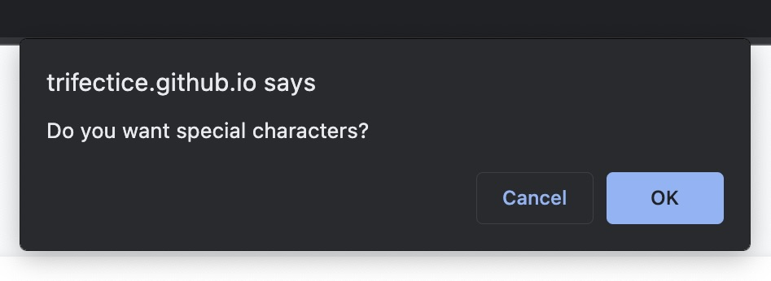
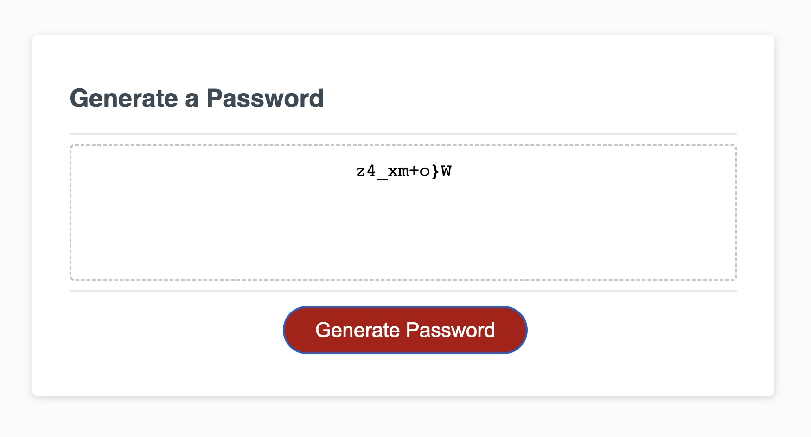

# Password Generator Starter Code

## Description

This is a random password generator I made to enable my work force to safely and reliable generate new passwords and for the new passwords to be generated by their own safety standards. You can select the amount of characters, and even the type of characters. With this project I learned valuable lessons in 
* How to create vars in JS,
* How to leaverage "if" statements
* How to use "For lops"
* And how to use the DOM to pull classes and ID's from HTML into JS.

## Usage

To use press the "Generate Password" button. You will be prompted to select a range of characters and after you must chose you character types. Bellow will be screen shots of examples of the application at work. click [here](https://trifectice.github.io/passwords-made-easier/) to check the site out for yourself! Bellow you will see screen shots of the working application in all parts.

* Beginning state of application page

    

* Length desired

    
   
* Lower character selection

    
   
* Upper character selection

    

* Numeric character selection

    

* Special character selection

    

* Result printed with all presets selected 

    
  

## Credits

Creadits go to my amazing cohort and of course
* Grady Peck
and 
* Aaron Brown

## License

MIT

---

